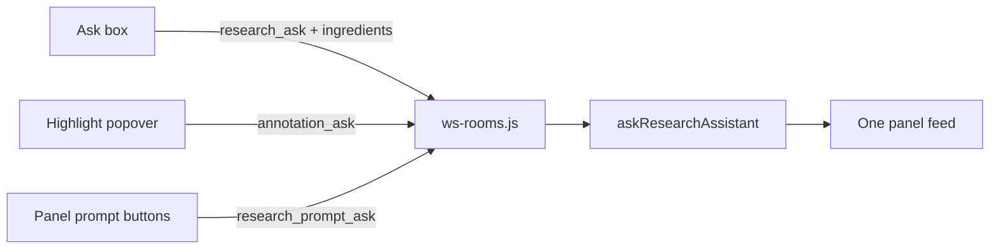

# Unify Ask with the Research panel

Custom Prompt placement (`{selection}` → popover, otherwise → panel button) already works. This plan does **not** change that. It removes the leftover **typed Ask** special case that still uses POST `/rec/[slug]/research`, a second list, freeform text, and no delete on Annotation cards.

## 1. Typed Ask: same server path as panel prompts

Today [`submitQuestion`](src/lib/research/ResearchPanel.svelte) sends `research_ask` then the **browser** POSTs `/rec/[slug]/research` and later `research_resolve` / `research_error`. That Vite process often has no `OPENROUTER_API_KEY` in `npm run dev` (only `node --env-file=.env server-ws-dev.js` loads `.env`), which is why Fact check works and Ask shows “not configured.”

Change `research_ask` in [`src/lib/server/ws-rooms.js`](src/lib/server/ws-rooms.js) to match `research_prompt_ask`:

- Client sends `question` plus Placeholder ingredients (`currentTab`, `transcript`, `videoTitle`) — same fields panel prompts already send.
- Server creates the pending research entry, then runs the lookup **on the WS process** (reuse `runResearchPromptAsk` / `buildCustomPromptRequest`).
- Template = the typed question. `outputFormat` = `'blocks'` (your choice).
- Placeholders already substitute in [`applyPlaceholders`](src/lib/server/research-assistant.js); `{selection}` stays empty for typed Ask (no highlight).

Stop sending `research_resolve` / `research_error` from the Ask form. Those client messages can stay for a short while as no-ops or be deleted once tests no longer use them.

## 2. Delete the HTTP Ask route

Remove browser use of [`src/routes/rec/[slug]/research/+server.js`](src/routes/rec/[slug]/research/+server.js). Delete the route (or leave a 410 stub only if something external still posts — nothing in the room UI should).

Update dependents:

- [`scripts/research-eval.js`](scripts/research-eval.js) currently POSTs `kind: 'voice'` with FOCUS TURN `context`. Point it at the same WS `research_ask` + ingredients (question text with Placeholders, not the old FOCUS TURN wrapper).
- Drop or rewrite [`tests/unit/research-route.test.js`](tests/unit/research-route.test.js) and [`tests/playwright/research_endpoint_status.spec.js`](tests/playwright/research_endpoint_status.spec.js).
- Playwright helpers that `page.route` POST `/research` for typed Ask: drive outcomes via the existing WS mock used for `research_prompt_ask` ([`mockCustomPromptOutcomes`](tests/playwright/helpers.js)).
- Retire `kind: 'voice'` / FOCUS TURN / GROUNDING in [`research-assistant.js`](src/lib/server/research-assistant.js) once eval and tests no longer need it. Ask becomes `kind: 'custom'` + blocks.

## 3. One feed in the panel

In [`ResearchPanel.svelte`](src/lib/research/ResearchPanel.svelte), on the annotations facet:

- Keep Ask + panel prompt buttons at the top.
- **One** scroll list: Annotations (Comments / Cards) and research entries (Ask + non-`{selection}` prompts), newest first using existing `at` timestamps.
- One empty state.
- Shared row chrome: quote only when present; `BlockList` when `blocks` exist; remove X.

Do **not** turn Ask into an Annotation (there is no frozen quote). Two stores stay; the UI stops pretending they are two products.

Update [`CONTEXT.md`](CONTEXT.md) **Ask** / research-entry wording so it no longer describes a separate feed or the HTTP route.

## 4. Remove on Annotation cards

Mirror `research_remove`:

- `removeAnnotation` in [`room-state-store.js`](src/lib/server/room-state-store.js)
- WS `annotation_remove` / `annotation_removed` in [`ws-rooms.js`](src/lib/server/ws-rooms.js)
- X on each Annotation in the panel, same Guest Research Access gate as `research_remove` (host always; guest only if the room allows AI). Removing is cleanup of shared state, not a new spend.

Unit tests next to the existing `research_remove` / annotation store tests.

## 5. Wrap long tokens

In [`BlockList.svelte`](src/lib/research/BlockList.svelte) (and annotation quote / text if needed): `overflow-wrap: anywhere; min-width: 0` on the list and items. Transcript already does `overflow-wrap: break-word`; blocks and quotes do not, so URLs with no spaces overflow.

## Tests (no real OpenRouter)

- WS: typed `research_ask` with `{transcript}` / `{current_tab}` only ships referenced ingredients; resolve includes `blocks`; missing key surfaces the same visible error as panel prompts (not a Vite-only failure).
- Panel: one list; Ask row and Fact-check Card both show an X; guest cannot remove when Guest Research Access is off.
- Playwright: Ask mock via WS; assert a block list renders; wrap is CSS-level (unit/CSS assertion, not pixel tests).
- `npx vitest run` plus targeted Playwright for the Ask/annotation specs.

## Out of scope

- Changing how `{selection}` splits popover vs panel buttons.
- Adding `--env-file` to `vite dev` (WS Ask makes that mismatch irrelevant for research).
