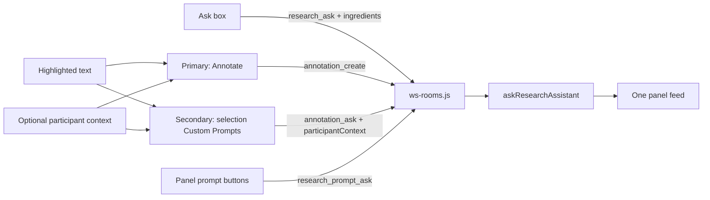

# Unify Ask with the Research panel

Custom Prompt placement (`{selection}` → popover, otherwise → panel button) already works. This plan does **not** change that. It removes the leftover **typed Ask** special case that still uses POST `/rec/[slug]/research`, a second list, freeform text, and no delete on Annotation cards.

## 0. Highlight popup: one composer, many Custom Prompts

Replace the current two-stage popup (click **Comment**, then reveal its
input) with one stable layout whenever text is highlighted:

1. Frozen highlighted quote.
2. One always-visible input, labelled **Add context or a comment…**.
3. One action row beneath it:
   - **Annotate** first, using the primary button style. It creates a human
     Comment and is disabled until the input contains text.
   - One visually secondary AI action for every configured Custom Prompt
     whose template references `{selection}`. `Fact check` is only an
     example title configured on the home screen; there is no hard-coded
     Fact-check action or behaviour. Keep the existing Research Assistant
     icon treatment so these remain visibly distinct from Annotate; colour
     plus the primary/secondary hierarchy is enough for this pass.

The input has two meanings determined by the button pressed:

- **Annotate** stores it as the Comment body.
- Any Custom Prompt runs with the frozen `{selection}` plus the input's
  trimmed text as optional participant context. The AI action remains
  enabled when the input is blank and then runs from the highlight alone.
  Pressing an AI action does not also create a human Comment.

Participant context is an explicit trigger-time addendum common to every
selection-based Custom Prompt, not a new Placeholder that a prompt author
can accidentally omit. Add a bounded `participantContext` field to
`annotation_ask`; sanitize it server-side and append it to the resolved
Custom Prompt only when non-blank. This is intentionally different from
ambient Notes/Transcript ingredients: the participant typed it for this
specific invocation. The prompt template still controls ambient context
through Placeholders.

Preserve `participantContext` on the resulting Card and render it with the
Card's frozen quote. A later reader must be able to see what the participant
added to the request rather than seeing an answer whose input has vanished.
The Annotation outbox must resend the same context unchanged after a
reconnect.

Remove `openSelectionActionId` and the Comment-mode transition from
[`RoomTabs.svelte`](src/lib/room/RoomTabs.svelte). The popup stays open while
the input has focus; Escape closes it. Enter submits Annotate, while each AI
action remains an explicit button press so typing context cannot
accidentally spend a Research Assistant call.

## 1. Typed Ask: same server path as panel prompts

Today [`submitQuestion`](src/lib/research/ResearchPanel.svelte) sends `research_ask` then the **browser** POSTs `/rec/[slug]/research` and later `research_resolve` / `research_error`. That Vite process often has no `OPENROUTER_API_KEY` in `npm run dev` (only `node --env-file=.env server-ws-dev.js` loads `.env`), which is why Fact check works and Ask shows “not configured.”

Change `research_ask` in [`src/lib/server/ws-rooms.js`](src/lib/server/ws-rooms.js) to match `research_prompt_ask`:

- Client sends `question` plus Placeholder ingredients (`currentTab`, `transcript`, `videoTitle`) — same fields panel prompts already send.
- Server creates the pending research entry, then runs the lookup **on the WS process**. Generalize `runResearchPromptAsk` into one server-owned research-entry runner shared by typed Ask and panel Custom Prompts.
- Use the question returned by `addResearchEntry` as the request template, not raw `msg.question`. That is the server's trimmed, 500-character canonical value, so the question displayed in the room and the question sent to the provider cannot disagree.
- Typed Ask keeps its own semantic identity as `kind` / usage mode `'ask'`, even though it shares execution and rendering with Custom Prompts. Retire the old `'voice'` shape; do not report typed questions as saved Custom Prompt usage.
- Typed Ask always requests `outputFormat: 'blocks'`.
- Placeholders already substitute in [`applyPlaceholders`](src/lib/server/research-assistant.js); `{selection}` stays empty for typed Ask (no highlight).

Stop sending `research_resolve` / `research_error` from the Ask form and delete both inbound WS handlers in the same change. Once completion is server-owned, a client must have no route to resolve or error another participant's entry.

## 2. Delete the HTTP Ask route

Remove browser use of [`src/routes/rec/[slug]/research/+server.js`](src/routes/rec/[slug]/research/+server.js) and delete the route. It is not a documented external API and no room UI should retain a second execution path.

Update dependents:

- [`scripts/research-eval.js`](scripts/research-eval.js) currently POSTs `kind: 'voice'` with FOCUS TURN `context`. Keep one authenticated WebSocket open, send `research_ask` with an explicit eval question containing `{transcript}`, and wait for the matching `research_entry` to reach `answered` or `errored`. Update the saved artifacts so they describe WS status/request data rather than an HTTP response.
- Drop or rewrite [`tests/unit/research-route.test.js`](tests/unit/research-route.test.js) and [`tests/playwright/research_endpoint_status.spec.js`](tests/playwright/research_endpoint_status.spec.js).
- Playwright helpers that `page.route` POST `/research` for typed Ask: drive outcomes via the existing WS mock used for `research_prompt_ask` ([`mockCustomPromptOutcomes`](tests/playwright/helpers.js)).
- Retire `kind: 'voice'` / FOCUS TURN / GROUNDING in [`research-assistant.js`](src/lib/server/research-assistant.js) once eval and tests no longer need it. Add the explicit `'ask'` request kind with Placeholder substitution and structured Blocks.
- Remove the now-unused `slug`, `postResearch`, `publishResearchResult`, `buildManualAskRequest`, `describeResearchError`, and stale HTTP/client-relay comments and exports.

## 3. One feed in the panel

In [`ResearchPanel.svelte`](src/lib/research/ResearchPanel.svelte), on the annotations facet:

- Keep Ask + panel prompt buttons at the top.
- **One** scroll list: Annotations (Comments / Cards) and research entries (Ask + non-`{selection}` prompts), newest first using existing `at` timestamps.
- One empty state.
- Shared row chrome: quote only when present; `BlockList` when `blocks` exist; remove X.
- Build the list through one tested pure projection that preserves the current scopes: active-Notes-tab Annotations, room-wide Transcript Annotations, and active-tab research entries. Tag each row as `annotation` or `research`, sort deterministically by `at`, and use a composite UI key such as `${type}:${id}`.
- Replace the separate annotation/research scroll refs with one feed ref so a new row consistently reveals and scrolls the same surface.

Do **not** turn Ask into an Annotation (there is no frozen quote). Two stores stay; the UI stops pretending they are two products.

Update [`CONTEXT.md`](CONTEXT.md) **Ask** / research-entry wording so it no longer describes a separate feed or the HTTP route.

## 4. Remove on Annotation cards

Mirror `research_remove`:

- `removeAnnotation` in [`room-state-store.js`](src/lib/server/room-state-store.js)
- WS `annotation_remove` / `annotation_removed` in [`ws-rooms.js`](src/lib/server/ws-rooms.js)
- X on each Annotation in the panel. Any joined participant may remove an
  Annotation, matching the shared Notes/Comment collaboration model;
  Guest Research Access controls AI spending and does not apply to this
  cleanup action. Keep `research_remove`'s existing gate unchanged.
- Route `annotation_removed` to both `ResearchPanel` and `RoomTabs`. Removing
  the feed row must also remove the corresponding Notes/Transcript highlight;
  the UI must not keep displaying an anchor for state the server deleted.

Unit tests next to the existing `research_remove` / annotation store tests.

## 5. Wrap long tokens

In [`BlockList.svelte`](src/lib/research/BlockList.svelte) (and annotation quote / text if needed): `overflow-wrap: anywhere; min-width: 0` on the list and items. Transcript already does `overflow-wrap: break-word`; blocks and quotes do not, so URLs with no spaces overflow.

## Tests (no real OpenRouter)

- WS: typed `research_ask` with `{transcript}` / `{current_tab}` only includes referenced ingredients in the provider request; resolve includes `blocks`; usage/eval mode remains `ask`; missing key surfaces the same visible error as panel prompts (not a Vite-only failure). Assert the server uses the canonical bounded question and rejects client-driven `research_resolve` / `research_error`.
- Highlight popup: quote, shared input and action row are visible together;
  Annotate is primary and requires text; every `{selection}` Custom Prompt
  is secondary, works with an empty input, and carries a non-empty
  `participantContext` through server resolution, Card storage, display and
  outbox replay.
- Panel: one list; Ask rows and Custom Prompt Cards both show an X; a guest
  may remove an Annotation when Guest Research Access is off, while the
  existing `research_remove` restriction remains unchanged.
- Playwright: Ask mock via WS; assert a block list renders; wrap is CSS-level (unit/CSS assertion, not pixel tests).
- `npm test` (including the standalone `ws-rooms.js` import check) plus
  targeted Playwright for the Ask/annotation specs.

## Out of scope

- Changing how `{selection}` splits popover vs panel buttons. This plan only
  changes the shared composer around the existing dynamically-derived
  selection prompt buttons.
- Adding `--env-file` to `vite dev` (WS Ask makes that mismatch irrelevant for research).
